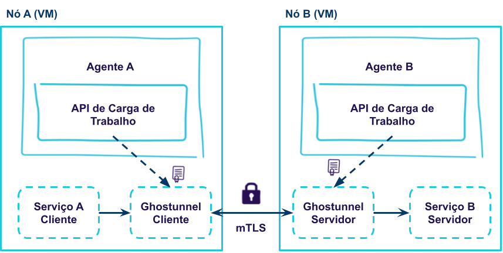

# SBSEG 2021

Este repositório contém um exemplo simples de atestação de cargas de trabalho com SPIRE. 
Além disso o proxy Ghostunnel eh utilizado para permitir que as cargas de trabalho se comuniquem transparentemente de forma segura via mTLS.

A arquitetura do exemplo eh ilustrada na Figura abaixo.



Nesse guias utilizaremos apenas 1 VM, mas manteremos os 2 agentes.

## Configurando o Servidor e Agentes SPIRE

Para este exemplo utilizamos a distribuição Ubuntu 20.04, em uma VM gom 1GB RAM e 1 vCPU.
Uma VM foi utilizada para instanciar o servidor SPIRE e os 2 agentes SPIRE. No entanto, a melhor ilustração desse experimento é com 3 VMs, 1 VM para o servidor SPIRE, e 2 outras VMs deveriam ser utilizadas para instanciar os agentes SPIRE com suas respectivas cargas de trabalho.

```bash
# servidor SPIRE
wget https://github.com/spiffe/spire/releases/download/v1.0.1/spire-1.0.1-linux-x86_64-glibc.tar.gz
tar zvxf spire-1.0.1-linux-x86_64-glibc.tar.gz
sudo cp -r spire-1.0.1/. /opt/spire/
sudo ln -s /opt/spire/bin/spire-server /usr/bin/spire-server

# agentes SPIRE 
wget https://github.com/spiffe/spire/releases/download/v1.0.1/spire-1.0.1-linux-x86_64-glibc.tar.gz
tar zvxf spire-1.0.1-linux-x86_64-glibc.tar.gz
sudo cp -r spire-1.0.1/. /opt/spire/
sudo ln -s /opt/spire/bin/spire-agent /usr/bin/spire-agent
# implantacao do Ghostunnel
wget https://github.com/ghostunnel/ghostunnel/releases/download/v1.6.0/ghostunnel-v1.6.0-linux-amd64
sudo cp ghostunnel-v1.6.0-linux-amd64 /usr/bin/
sudo chmod +x /usr/bin/ghostunnel-v1.6.0-linux-amd64
```

## Iniciando Servidor e Agentes SPIRE

Primeiro iniciamos o servidor SPIRE.
Lembre-se de abrir a porta 8081.

```bash
# servidor SPIRE
cd ~/spire-1.0.1/
# configurar em server.conf: 
#    bind_address = "0.0.0.0" 
#    registration_uds_path = "./data/server.sock"
spire-server run -config conf/server/server.conf
```

Em seguida, obtemos dois tokens de entradas, junto ao servidor SPIRE, para os agentes.
Os agentes terão os seguintes SPIFFE IDS: spiffe://example.org/agent1 e spiffe://example.org/agent2.

```bash
spire-server token generate -socketPath ./data/server.sock -spiffeID spiffe://example.org/agent1
spire-server token generate -socketPath ./data/server.sock -spiffeID spiffe://example.org/agent2
```

Depois iniciamos os agentes com os tokens obtidos.

```bash
cd ~/spire-1.0.1/
# Aqui devemos ter 2 arquivos de configuração: um para o agente1, outro para o agente2.
# configurar em agent agent1.conf:
#    socket_path ="./data/agent1.sock"
#    data_dir = "./data/agent1"
# ajustar path no plugin de KeyStorage:
#   KeyManager "disk" {
#        plugin_data {
#            directory = "./data/agent1"
#        }
#   }
# iniciar ambos os agentes com seus respectivos join tokens
spire-agent run -config conf/agent/agent1.conf -joinToken "<token>"
#repetir os passos para o agent2
```

## Executando a DEMO

Primeiro é necessário criar, no servidor, os registros de entrada correspondente às cargas de trabalho.
Nesse exemplo, SVIDs serão entregues às cargas de trabalho com user id 1000.

Em um contexto mais generalista, talvez fizesse mais sentido que os SPIFFE IDs refletissem os seletores atestados.
Porém, para que esse exemplo específico com Ghostunnel fique mais compreensível, utilizaremos SPIFFE IDs que identifiquem quem é Ghostunnel no modo cliente e quem é o Ghostunnel no modo servidor.

```bash
# servidor SPIRE: criar registros de entrada para ghostunnel
spire-server entry create -socketPath ./data/server.sock -selector unix:uid:1000  -spiffeID spiffe://example.org/proxy/ghostunnel-client  -parentID spiffe://example.org/agent1
spire-server entry create -socketPath ./data/server.sock -selector unix:uid:1000  -spiffeID spiffe://example.org/proxy/ghostunnel-server  -parentID spiffe://example.org/agent2
```

Depois da criacao dos registros de entrada é possível iniciar as cargas de trabalho.
No agente 1 executaremos o Ghostunnel no modo cliente, de modo que possa receber mensagens locais e rapassar para serviços remotos com autenticação mTLS.
E no agente 2 executaremos o Ghostunnel no modo servidor, de modo que aceite requisições de serviços que possuam SVID com determinado SPIFFE ID.

```bash
# Agente 1
cd ~/spire-1.0.1/
ghostunnel-v1.6.0-linux-amd64 client --use-workload-api-addr "unix://${PWD}/data/agent1.sock" --listen=localhost:9001 --target=localhost:9002

# Agente 2
cd ~/spire-1.0.1/
ghostunnel-v1.6.0-linux-amd64 server --use-workload-api-addr "unix://${PWD}/data/agent2.sock" --listen=localhost:9002 --target=localhost:9003 --allow-uri spiffe://example.org/proxy/ghostunnel-client
```

Finalmente, usamos socat para enviar uma mensagem para o Ghostunnel no agente 1, e imprimir a mensagem recebida no agente 2.
Lembre-se que a VM do agente 2 precisa estar com a porta 8081 aberta.

```bash
# Aplicação final servidora no Agente 2
socat TCP-LISTEN:9003,fork STDOUT

# Aplicação final cliente no Agente 1
echo "SBSEG2021" | socat STDIN TCP:localhost:9001
```
